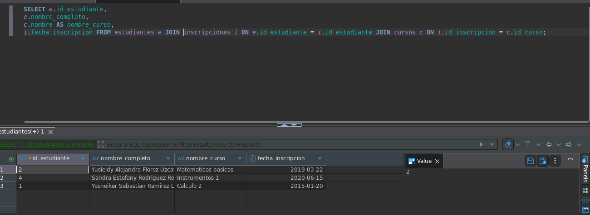
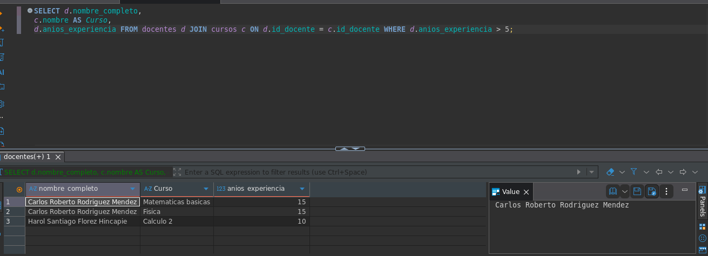
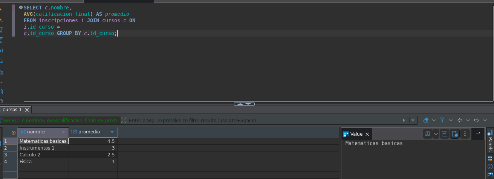
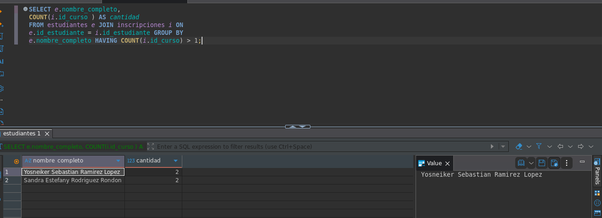
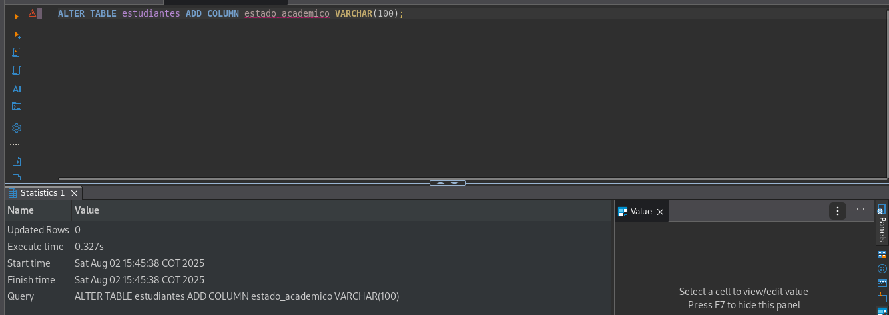
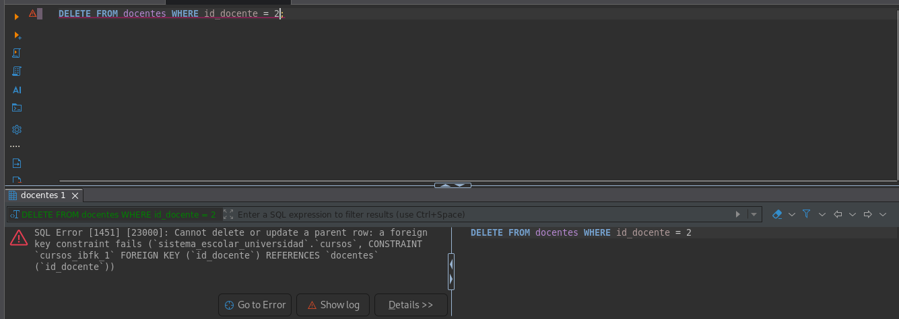
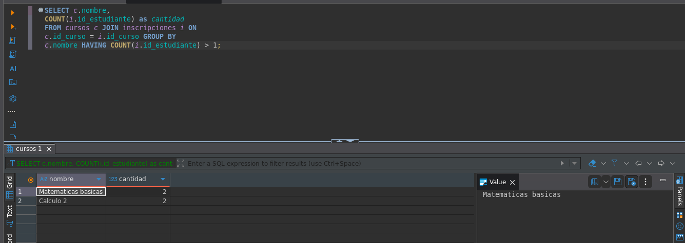
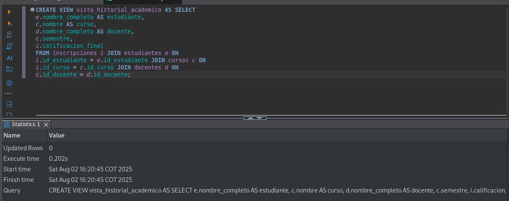

# TRAINING DOCUMENTATION.

### 1) 
-- Get the list of all students along with their enrollments and courses (JOIN).
`SELECT e.id_estudiante, e.nombre_completo, c.nombre AS nombre_curso, i.fecha_inscripcion FROM estudiantes e JOIN inscripciones i ON e.id_estudiante = i.id_estudiante JOIN cursos c ON i.id_curso = c.id_curso;`

### 2)
-- List courses taught by teachers with more than 5 years of experience.
`SELECT d.nombre_completo, c.nombre AS Curso, d.anios_experiencia FROM docentes d JOIN cursos c ON d.id_docente = c.id_docente WHERE d.anios_experiencia > 5;`

### 3)
-- Get the average grade per course (GROUP BY + AVG).
`SELECT c.nombre, AVG(calificacion_final) AS promedio FROM inscripciones i JOIN cursos c ON i.id_curso = c.id_curso GROUP BY c.id_curso;`

### 4)
-- Show students who are enrolled in more than one course (HAVING COUNT(*) > 1).
`SELECT e.nombre_completo, COUNT(i.id_curso ) AS cantidad FROM estudiantes e JOIN inscripciones i ON e.id_estudiante = i.id_estudiante GROUP BY e.nombre_completo HAVING COUNT(i.id_curso) > 1;`

### 5)
-- Add a new column estado_academico to the students table (ALTER TABLE).
`ALTER TABLE estudiantes ADD COLUMN estado_academico VARCHAR(100);`

### 6)
-- Delete a teacher and observe the effect on the courses table (use of ON DELETE in FK). ' I do not know why this show me this problem :( '
`DELETE FROM docente WHERE id_docente = 2;`

### 7)
-- Consult courses with more than 2 students enrolled (GROUP BY + COUNT + HAVING).
`SELECT c.nombre, COUNT(i.id_estudiante) as cantidad FROM cursos c JOIN inscripciones i ON c.id_curso = i.id_curso GROUP BY c.nombre HAVING COUNT(i.id_estudiante) > 1;`

### 8)
-- CREATE VIEW
`CREATE VIEW vista_historial_academico AS SELECT e.nombre_completo AS estudiante, c.nombre AS curso, d.nombre_completo AS docente, c.semestre, i.calificacion_final FROM inscripciones i JOIN estudiantes e ON i.id_estudiante = e.id_estudiante JOIN cursos c ON i.id_curso = c.id_curso JOIN docentes d ON c.id_docente = d.id_docente;`

